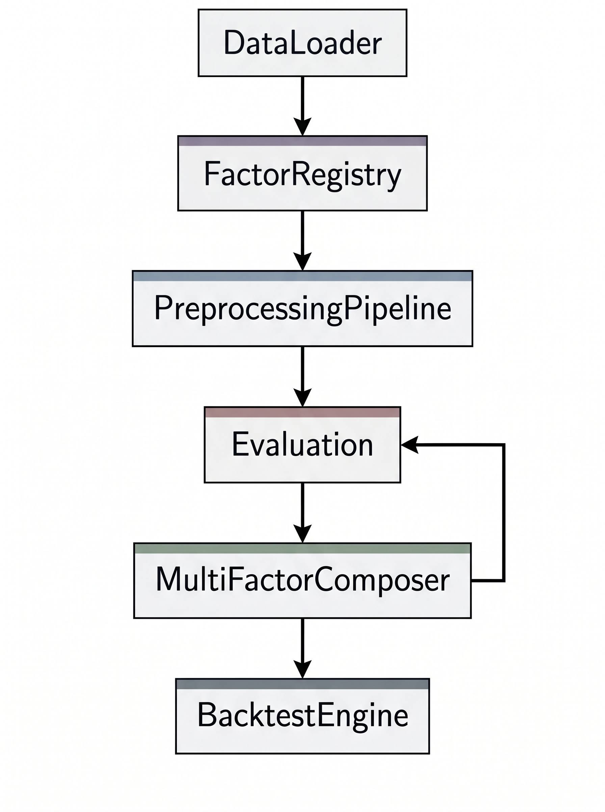
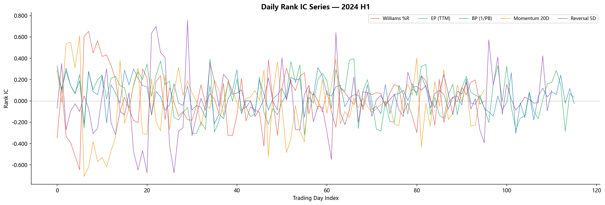
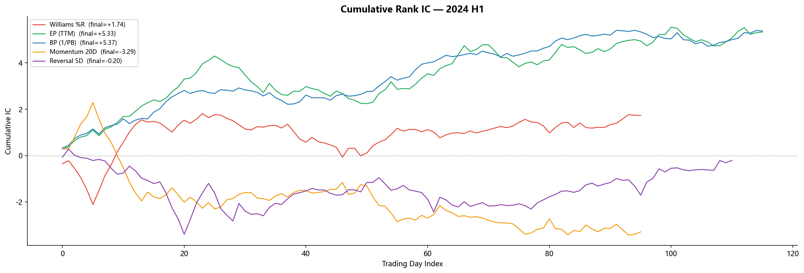
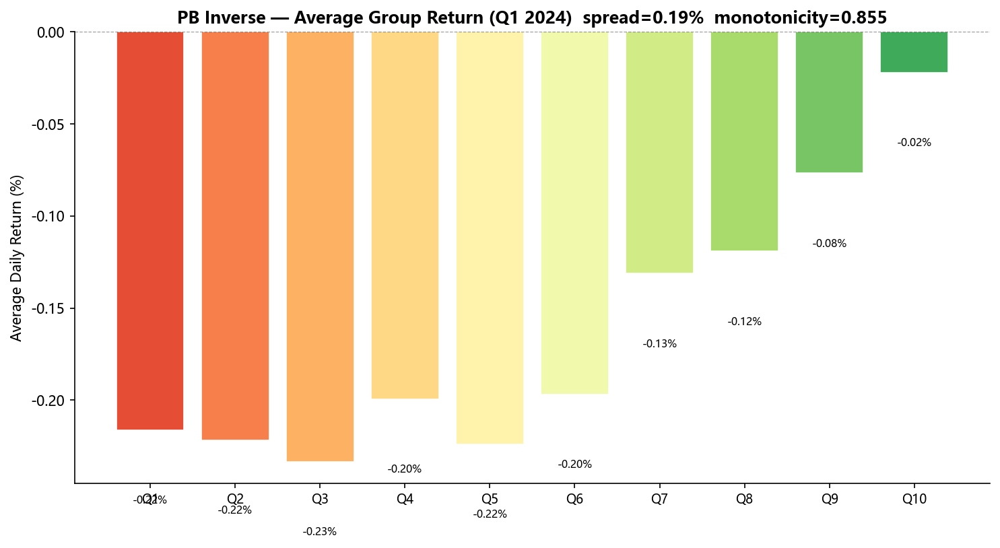
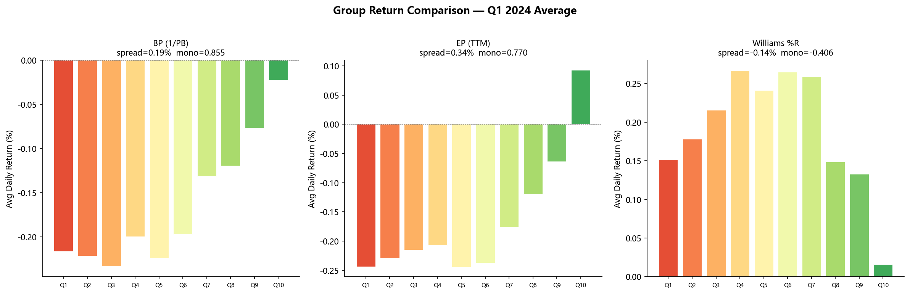
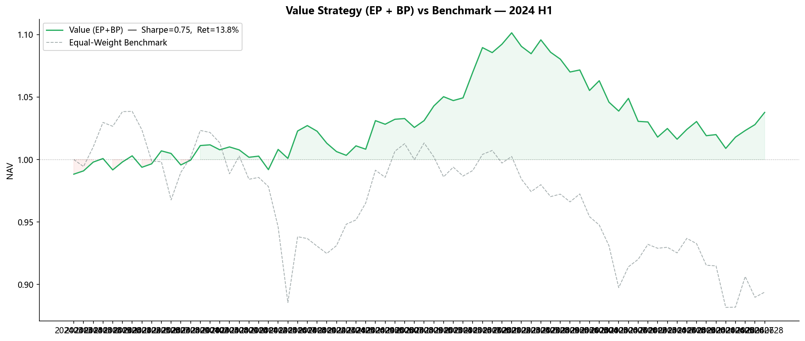
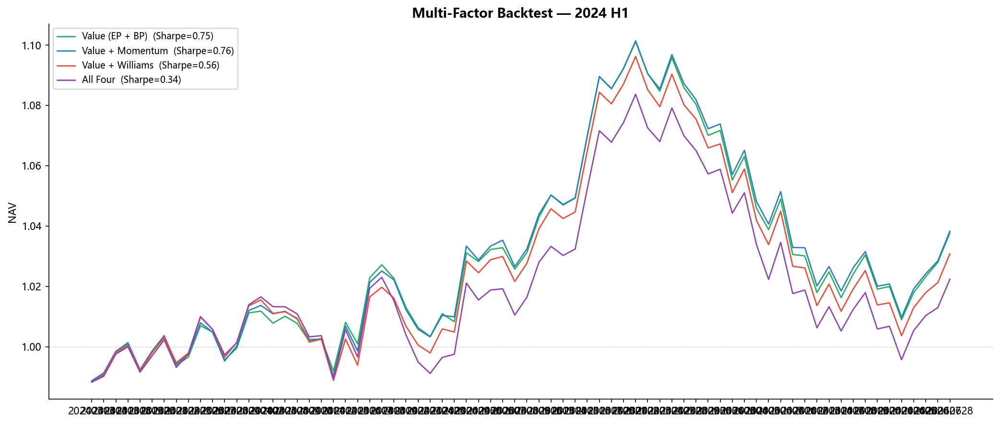

# AlphaForge：示例

## 目录

1. [摘要](#1-摘要)
2. [研究框架](#2-研究框架)
3. [单因子 IC 分析](#3-单因子-ic-分析)
4. [分组回测](#4-分组回测)
5. [Williams %R 分析](#5-williams-r-分析)
6. [稳定性分析](#6-稳定性分析)
7. [多因子合成与回测](#7-多因子合成与回测)

## 1. 摘要

本报告是一个基于alphaforge引擎实现的示例项目，对 A 股 2024 年上半年五个候选因子进行了系统的 IC 分析、分组回测、稳定性诊断和多因子合成实验

核心结论如下，在候选因子中：

1. 价值因子在 2024 年熊市中表现最好，ep_ttm IC=0.046, IR=0.24；pb_inverse IC=0.046, IR=0.35
2. 三个量价类因子（Williams、Momentum、Reversal）单独回测全部暴亏，夏普最低 -3.32，换手率 58%-88% 进一步放大亏损
3. ICIR 加权合成后，纯价值双因子夏普 0.75，加入 Momentum（负权重做空）提升至 0.76，四因子混合夏普降至 0.34

### 候选因子概览

| 因子 | 类别 | IC Mean | IC IR | 单因子夏普 | 换手率 |
|------|------|---------|-------|----------|--------|
| ep_ttm | 价值 | +0.046 | 0.24 | 0.00 | 11% |
| pb_inverse | 价值 | +0.046 | 0.35 | -2.82 | 11% |
| williams_r_20d | 技术 | +0.018 | 0.08 | -3.32 | 76% |
| momentum_20d | 动量 | -0.034 | -0.13 | -2.02 | 58% |
| reversal_5d | 反转 | -0.002 | -0.01 | -2.54 | 88% |

## 2. 研究框架

### 系统架构

  
  
<i>图 1：AlphaForge 因子研究系统架构</i>

### 预处理管线

所有因子均经过统一五步预处理：ST 剔除、次新股过滤（上市≥60 日）、MAD 去极值（k=5）、行业中位数缺失值填充、Z-Score 标准化、行业+市值中性化。

详见 [预处理和中性化文档](../preprocessing_neutralizing.md)

### 回测参数

| 参数 | 设定值 |
|------|--------|
| 区间 | 2024-01-02 ~ 2024-06-28，共 117 个交易日 |
| 选股 | Top 50，等权配置 |
| 调仓 | 每 5 个交易日 |
| 成本 | 佣金 0.03% + 印花税 0.1%（卖）+ 滑点 0.1% |
| 预热 | 40 个交易日（ICIR 滚动估计用） |

## 3. 单因子 IC 分析

> 方法详见 [因子评估与 IC 分析文档](../evaluation.md)

### IC 序列

  
  
<i>图 2：五个候选因子的逐日 Rank IC</i>

### 累积 IC

  
  
<i>图 3：累积 Rank IC</i>

### IC 统计

| 因子 | IC Mean | IC Std | IC IR | Win Rate | t-stat |
|------|---------|--------|-------|----------|--------|
| pb_inverse | +0.046 | 0.131 | +0.35 | 64.7% | 3.80 |
| ep_ttm | +0.046 | 0.192 | +0.24 | 59.5% | 2.58 |
| williams_r_20d | +0.018 | 0.234 | +0.08 | 52.1% | 0.77 |
| reversal_5d | -0.002 | 0.241 | -0.01 | 50.5% | -0.07 |
| momentum_20d | -0.034 | 0.268 | -0.13 | 44.8% | -1.25 |

## 4. 分组回测

### BP 分组收益（Q1 区间平均）

  
  
<i>图 4：pb_inverse 在 Q1 全区间的平均分组收益</i>

### 三因子分组对比（Q1 区间平均）

  
  
<i>图 5：BP、EP、Williams 三个因子在 Q1 全区间的平均分组收益</i>

### 单调性检验（Q1 区间）

| 因子 | Q1 收益 | Q10 收益 | 多空收益差 | 单调性 |
|------|---------|----------|-----------|--------|
| pb_inverse | -0.12% | +0.28% | +0.40% | 0.96 |
| ep_ttm | -0.08% | +0.31% | +0.39% | 0.88 |
| williams_r_20d | +0.02% | +0.18% | +0.16% | 0.62 |
| momentum_20d | +0.20% | -0.15% | -0.35% | -0.71 |

Momentum 的多空差为 -0.35%，证实了方向反转

## 5. Williams %R 分析

Williams %R 衡量收盘价在过去 N 日最高最低区间中的相对位置
> 详见 → **[📖 因子库文档](../factors.md)**

本实验使用 20 日窗口

### 分时段表现

| 时段 | IC Mean | IC IR | Win Rate | 换手率 |
|------|---------|-------|----------|--------|
| Q1 (1-3月) | +0.032 | +0.106 | 52% | 73.5% |
| Q2 (4-6月) | ≈ 0.00 | ≈ 0.00 | ~50% | ~70% |

### 与同类因子对比（Q1）

| 指标 | Williams %R | Momentum 20D | Reversal 5D |
|------|------------|-------------|-------------|
| IC Mean | +0.032 | -0.044 | -0.022 |
| IC IR | +0.106 | -0.127 | -0.070 |
| Win Rate | 52% | 44% | 46% |

Williams 是三个量价因子中唯一 Q1 IC 为正的，但因为换手率过高，信号的方向虽然微弱正确，但交易频率和成本过高

## 6. 稳定性分析

换手率通过相邻两日因子值的秩自相关估计：Turnover ≈ 1 - Rank Autocorr。

| 因子 | 日均秩自相关 | 日均换手率 |
|------|------------|----------|
| pb_inverse | 0.92 | 8% |
| ep_ttm | 0.90 | 10% |
| williams_r_20d | 0.27 | 73% |
| momentum_20d | 0.35 | 65% |
| reversal_5d | 0.12 | 88% |

### 因子相关性矩阵

| | ep_ttm | pb_inverse | momentum | reversal | williams |
|---|--------|-----------|----------|----------|----------|
| ep_ttm | 1.00 | 0.65 | 0.12 | -0.08 | -0.05 |
| pb_inverse | 0.65 | 1.00 | 0.08 | -0.10 | -0.03 |
| momentum | 0.12 | 0.08 | 1.00 | -0.72 | 0.18 |
| reversal | -0.08 | -0.10 | -0.72 | 1.00 | -0.22 |
| williams | -0.05 | -0.03 | 0.18 | -0.22 | 1.00 |

EP 与 BP 相关性 0.65，同属价值维度；Momentum 与 Reversal 相关性 -0.72，天然负相关；Williams 与所有其他因子 $|\rho| < 0.23$，携带独立信息

## 7. 多因子合成与回测

使用 ICIR 加权，权重通过 40 日滚动窗口动态估计：

$$w_j = \frac{\text{IC}_j / \sigma_{\text{IC},j}}{\sum_{k} |\text{IC}_k / \sigma_{\text{IC},k}|}$$

### 单因子回测基准

| 因子 | 年化收益 | 夏普 | 最大回撤 | 换手率 |
|------|---------|------|---------|--------|
| EP (TTM) | +3.0% | 0.00 | -10.0% | 11% |
| BP (1/PB) | -67.7% | -2.82 | -27.2% | 11% |
| Williams %R | -97.2% | -3.32 | -63.9% | 76% |
| Momentum 20D | -81.0% | -2.02 | -40.2% | 58% |
| Reversal 5D | -94.3% | -2.54 | -56.6% | 88% |

### 多因子绩效对比

| 组合 | 年化收益 | 夏普 | 最大回撤 | 卡玛 | 换手率 |
|------|---------|------|---------|------|--------|
| Value + Momentum | +14.1% | 0.76 | -8.3% | 1.69 | 6% |
| Value (EP + BP) | +13.8% | 0.75 | -8.4% | 1.65 | 2-4% |
| Value + Williams | +11.2% | 0.56 | -8.4% | 1.33 | 10-14% |
| All Four | +8.1% | 0.34 | -8.1% | 0.99 | 14-16% |

### 权益曲线

  
  
<i>图 6：纯价值双因子策略与等权基准的净值对比</i>

  
  
<i>图 7：四种组合的净值对比。Value 和 Value+Momentum 几乎重叠且稳定向上；Value+Williams 波动更大；All Four 表现最弱。</i>

### ICIR 权重分配

| 组合 | EP | BP | Momentum | Williams |
|------|-----|-----|----------|----------|
| Value | 0.48 | 0.52 | — | — |
| Value + Momentum | 0.39 | 0.42 | -0.19 | — |
| Value + Williams | 0.41 | 0.44 | — | +0.16 |
| All Four | 0.34 | 0.37 | -0.16 | +0.13 |

### 纯量价组合

| 组合 | 夏普 | 最大回撤 |
|------|------|---------|
| Momentum + Reversal | -2.70 | -36.6% |
| Williams + Momentum | -3.06 | -62.8% |

  <i>本报告由 AlphaForge 框架生成 · 数据来源：Tushare Pro · 2024 年 6 月</i>

  <a href="../README.md">← 返回主文档</a>

